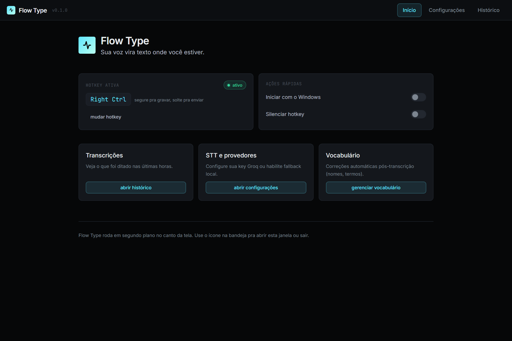
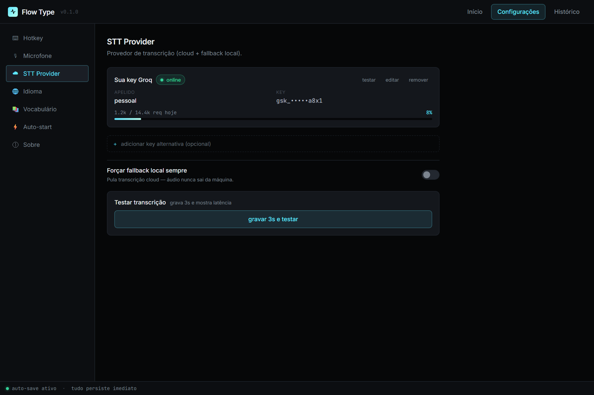
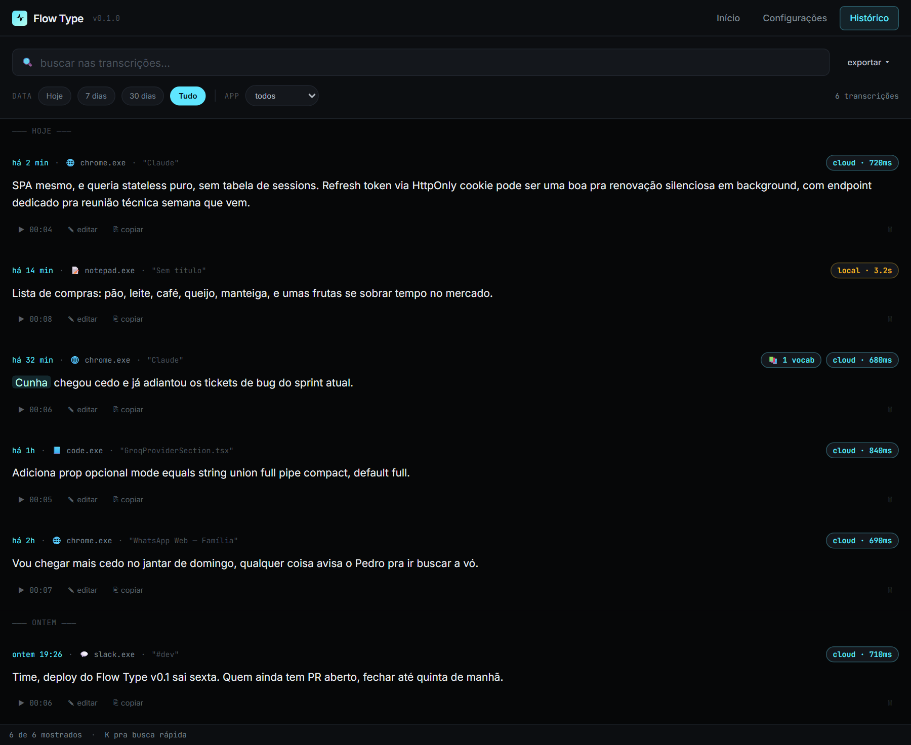
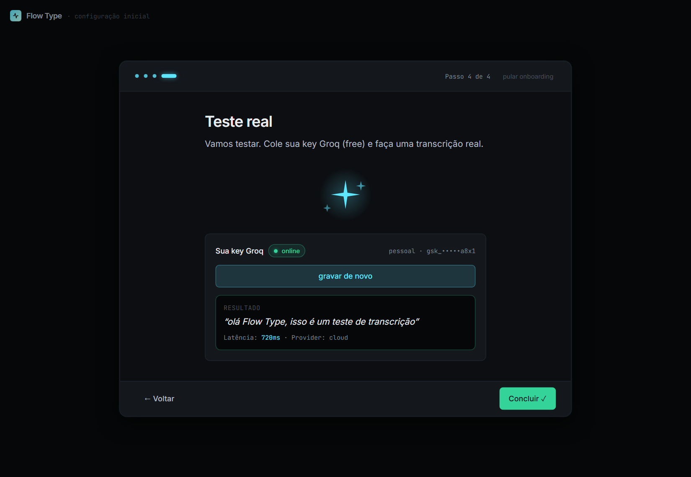

<div align="center">


# Flow Type

**Sua voz vira texto onde você estiver.**

Dictation universal pra Windows: segure `Right Ctrl`, fale, solte. Em menos de 1 segundo o texto cola no campo ativo — Claude, ChatGPT, Notepad, WhatsApp Web, VSCode, qualquer app.

[](LICENSE)
[](#instalação)
[](#por-que-flow-type)
[](#qualidade)
[](https://flow-type-189.netlify.app)

[**🌐 Site oficial**](https://flow-type-189.netlify.app) · [**⬇ Baixar para Windows**](https://flow-type-189.netlify.app/download/flowtype-setup-v0.1.5.exe) · [**📖 FAQ**](https://flow-type-189.netlify.app/#faq)

</div>

---

## Por que Flow Type

| | |
|---|---|
| 🆓 **Free, sem cap de uso** | Use o quanto quiser. Sem trial, sem cartão, sem assinatura. |
| ⚡ **Sub-1 segundo** | Groq Whisper Large v3 Turbo na nuvem. p50 medido: **837 ms** do hotkey ao paste. |
| 🌐 **Funciona em qualquer app** | Clipboard paste universal. Whitelist/blacklist por app pra controle fino. |
| 💻 **Fallback local offline** | `faster-whisper` opcional pra rodar 100% sem internet (privacy-aware). |
| 📚 **Vocabulário custom** | Lista `term_wrong → term_correct` global ou por app. Corrige na hora. |
| 🔍 **Histórico searchable** | SQLite + FTS5 + filtros por data/app. Export Markdown ou JSON. |
| 🎨 **Overlay always-on-top** | 4 estados visuais (idle / armed / capturing / processing). 200×64 px discreto. |
| 🚀 **Auto-start Windows** | Liga junto com o login. Roda silencioso no tray. |

---

## Como funciona

```
┌─────────────────────────────────────────────────────────────┐
│  Você segura Right Ctrl                                      │
│       │                                                       │
│       ▼                                                       │
│  uIOhook detecta hold ──▶ Overlay vai pra "armed"           │
│       │                                                       │
│       ▼                                                       │
│  MediaRecorder captura mic (webm/opus)                       │
│       │                                                       │
│       ▼                                                       │
│  Você solta Right Ctrl                                        │
│       │                                                       │
│       ▼                                                       │
│  SttGateway decide cascade:                                  │
│    1. Groq cloud (sub-1s) ──┐                                │
│    2. faster-whisper local ─┴─▶ Texto transcrito             │
│       │                                                       │
│       ▼                                                       │
│  Vocab corrections aplicadas (kunha → Cunha)                 │
│       │                                                       │
│       ▼                                                       │
│  TextInjector:                                                │
│    - snapshot clipboard                                       │
│    - escreve texto novo                                       │
│    - re-foca janela alvo (PowerShell SetForegroundWindow)    │
│    - simula Ctrl+V via nut.js                                 │
│    - restaura clipboard original                             │
│       │                                                       │
│       ▼                                                       │
│  Texto aparece onde teu cursor estava ✨                     │
└─────────────────────────────────────────────────────────────┘
```

---

## Screenshots

<table>
<tr>
<td width="50%"></td>
<td width="50%"></td>
</tr>
<tr>
<td align="center"><sub>Tela inicial — tray-first, abre só on-demand</sub></td>
<td align="center"><sub>Settings · STT Provider — uma key Groq basta</sub></td>
</tr>
<tr>
<td width="50%"></td>
<td width="50%"></td>
</tr>
<tr>
<td align="center"><sub>Histórico — busca FTS5, filtros, export</sub></td>
<td align="center"><sub>Onboarding — teste real no setup</sub></td>
</tr>
</table>

---

## Instalação

### Opção 1 — Instalador (`.exe`)

1. Baixe [**Flow Type Setup 0.1.5.exe**](https://flow-type-189.netlify.app/download/flowtype-setup-v0.1.5.exe) (83 MB)
2. Execute o instalador
3. ⚠️ Windows vai mostrar **SmartScreen warning** (v0.1 ainda sem code signing): clique **Mais informações → Executar mesmo assim**
4. Siga o onboarding (4 passos · ~1 minuto)
5. Pronto. Segure `Right Ctrl` em qualquer app e fale.

### Opção 2 — Portable (`.exe` standalone)

[**Flow Type-0.1.5-portable.exe**](https://flow-type-189.netlify.app/download/flowtype-portable-v0.1.5.exe) — não instala, roda direto da pasta.

### Verificar integridade (opcional)

```powershell
Get-FileHash flowtype-setup-v0.1.5.exe -Algorithm SHA256
# Esperado: 3c42357e3ffb0f0f4b080b24261d34dd43f7d753c0ccdd430287cd31f5f81cdf
```

Checksums completos: [download/checksums.txt](https://flow-type-189.netlify.app/download/checksums.txt)

### Requisitos

- **Windows 10 ou superior**
- **Microfone** (qualquer)
- **Conta gratuita no [Groq](https://console.groq.com)** pra transcrição cloud (alternativa: instalar Python 3.11+ e `pip install faster-whisper` pra fallback offline)
- **~200 MB livre em disco**

---

## Quick Start (30 segundos)

```text
1. Instala
2. Onboarding pede tua key Groq (free, criar em 30s em console.groq.com)
3. Cola a key
4. Click "Gravar 5s e testar" → fala uma frase → confirma que apareceu
5. Concluir
6. Abra qualquer app (Notepad, Claude, WhatsApp Web…)
7. Segure Right Ctrl, fale, solte
8. Texto cola onde teu cursor estava
```

---

## Arquitetura (pra dev)

### Stack

- **Electron 31** + **TypeScript** + **React 18** + **electron-vite**
- **Tailwind 4** (UI), **Framer Motion** (animações)
- **SQLite** via `better-sqlite3` + FTS5 (histórico full-text)
- **uIOhook-napi** (hotkey hold/release — `globalShortcut` do Electron não detecta release)
- **nut.js** (text injection — clipboard paste + typing fallback)
- **PowerShell P/Invoke** (`GetForegroundWindow`, `SetForegroundWindow`)
- **Groq Whisper Large v3 Turbo** (STT cloud, free tier 14.4k req/dia)
- **faster-whisper small.en** (STT local fallback opcional)
- **pino** (structured logging em `%APPDATA%/flowtype/logs/`)

### Estrutura

```
src/
├── main/                       # Electron main process (Node)
│   ├── index.ts                # Entry — janelas + tray + hotkey + IPC
│   ├── windows/                # MainWindow + OverlayWindow
│   ├── hotkey/                 # uIOhook manager (hold/release)
│   ├── tray/                   # Tray icon + menu
│   ├── stt/                    # SttGateway, GroqKeyPool, providers
│   ├── injection/              # TextInjector, clipboard, active-window
│   ├── db/                     # SQLite connection, migrations, seed
│   ├── repos/                  # TranscriptionRepo, VocabRepo, etc
│   ├── jobs/                   # daily-cleanup
│   ├── ipc/                    # IPC router + handlers
│   ├── state/                  # window-state, settings-store
│   └── auto-start.ts           # Windows boot autostart
├── preload/                    # contextBridge APIs (main + overlay)
├── renderer/
│   ├── src/main/               # Main window UI (Settings + Histórico + Onboarding)
│   ├── src/overlay/            # Overlay UI (4 estados visuais)
│   ├── src/shared/             # Componentes + hooks compartilhados
│   └── src/styles/             # globals.css + Tailwind
└── shared/                     # ipc-types, db-types, errors
```

### Pipelines

- **STT cascade (2 níveis):** se a key Groq cadastrada esgota (429) ou está offline, cai automaticamente pro faster-whisper local.
- **Text injection:** snapshot clipboard → write texto → re-foca janela alvo → simula Ctrl+V → sleep 80ms → restore clipboard. Whitelist/blacklist por exe name.
- **Vocab pipeline:** corrections aplicadas pós-STT, antes do paste. Word-boundary regex, case-sensitive opcional, scope global ou per-app.

Detalhes em [architecture/](architecture/):
- [data-model.md](architecture/data-model.md) — schema SQLite completo
- [internal-contracts.md](architecture/internal-contracts.md) — 40 canais IPC + interfaces TS
- [architecture-decisions.md](architecture/architecture-decisions.md) — 16 ADRs justificando escolhas
- [feature-list.json](architecture/feature-list.json) — 62 features testáveis decompondo o produto
- [design-spec.md](architecture/design-spec.md) — design system (paleta cyan elétrico, tipografia, componentes, animações)

---

## Build from source

```bash
git clone https://github.com/Matheus-Machaado/flow-type.git
cd flow-type
npm install

# Dev (hot reload)
npm run dev

# Build app
npm run build

# Gerar instalador Windows (.exe + .zip portable)
npm run dist

# Testes
npm run test           # Vitest (171/171 passing)
npm run test:e2e       # Playwright-Electron (6/7 passing + 1 skip)
npm run lighthouse     # Site Astro (Lighthouse ≥95 em 4 categorias)
```

### Pré-requisitos pra build

- **Node 24+** (`node --version`)
- **Python 3.11+** (build de dependências nativas — `python --version`)
- **Visual Studio Build Tools 2022** (rebuild de `uiohook-napi`/`better-sqlite3`/`nut.js`; com prebuilds geralmente dispensado)

---

## Qualidade

- ✅ **171/171** unit tests (vitest, 20 suites)
- ✅ **6/7** E2E tests (playwright-electron; 1 skip habilitável)
- ✅ **p50 = 837ms** hotkey → paste (alvo: < 1500ms)
- ✅ **Lighthouse 100/96/100/100** no site (perf/a11y/best-practices/seo)
- ✅ **Build dev** + **typecheck** sem erros
- ✅ **CSP/HSTS/X-Frame** strict no site (Netlify `_headers`)

---

## Privacidade

- 🔒 **Toggle "Forçar local sempre"** nas Settings — áudio NUNCA sai da máquina
- 💾 **Áudios + histórico locais** em `%APPDATA%/flowtype/` (SQLite + arquivos `.opus`)
- 🚫 **Zero telemetria** — sem analytics, sem tracking, sem ping pra servidor de ninguém (exceto a request STT pra Groq, opcional)
- 🔑 **API keys** ficam apenas no teu disco (`%APPDATA%/flowtype/db.sqlite`). v0.1 em texto plano; encryption via Windows Credential Manager está no roadmap pra v0.2

---

## Roadmap

### v0.1 (atual) ✅
- Windows 10/11
- Right Ctrl hold-to-talk
- Groq cloud + fallback local
- Settings + Histórico + Onboarding
- Vocab custom global/per-app
- NSIS installer + portable

### v0.2 (planejado)
- Code signing (EV cert) — eliminar SmartScreen warning
- Auto-update via electron-updater
- macOS build (Accessibility API)
- Bundle automático do `faster-whisper small.en` no instalador
- Encryption das API keys via Windows Credential Manager

### v0.3+
- Linux (X11 primeiro; Wayland depois)
- Wake word "Hey Flow" (opcional, opt-in)
- Plugin API pra integrações (Raycast, Alfred-like)
- Multi-idioma simultâneo (auto-detect frase a frase)

---

## Contribuir

PRs bem-vindos. Padrão simples:
1. Fork
2. Branch (`feat/nome-da-feature` ou `fix/bug-id`)
3. Testes passando (`npm run test`)
4. PR com descrição clara do quê + porquê

Issues abertos pra discussão antes de PR grande — economiza tempo.

---

## License

[MIT](LICENSE) © 2026 Matheus Machado

---

<div align="center">

**Built solo por [@Matheus-Machaado](https://github.com/Matheus-Machaado)** · com [Claude Code](https://claude.com/claude-code) como par de programação

[🌐 Site](https://flow-type-189.netlify.app) · [⬇ Download](https://flow-type-189.netlify.app/download/flowtype-setup-v0.1.5.exe) · [📖 FAQ](https://flow-type-189.netlify.app/#faq) · [🐛 Issues](https://github.com/Matheus-Machaado/flow-type/issues)

</div>
